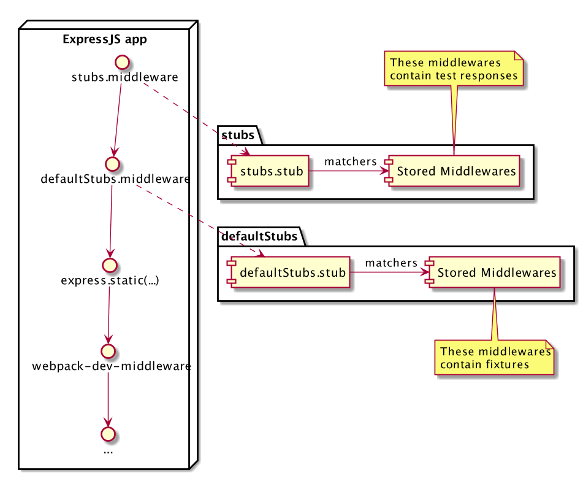

title: Test-Driven Development in JavaScript
author:
  name: Ivan Strelkov
  twitter: i_strel
output: basic.html
controls: true

--

# Что такое?

--

## Классика
<center>
  
</center>

--

## Комплексный подход
<center>
  
</center>

--

# Как внедрить?

--
<center>
  
</center>

--

## Инструменты
* Webdriver.IO
* Mocha + Sinon.JS + Chai.JS
* Karma runner
* Rosie JS

--

## Пререквизиты
* ExpressJS для статики
* Fixtures
* Stubs middleware

--
<center>
  
</center>
--
## Шаг 1. Первый функциональный тест
```javascript
	it('should do some chai assertions', function() {
    var markersLeft = _.times(10, function() {
      return Factory.build('wish', {
        latitude:  defaultLocation.lat + random(0.01),
        longitude: defaultLocation.lng - 0.2 + random(0.01)
      });
    });
    var markersRight = '...';

    var markers = _(markersLeft).union(markersRight).shuffle().value();

    Stubs.stub.withArgs( match.has('url', match('/wishes.json')) )
      .returns(function(req, res) { res.json(markers); });

    return browser.url('http://localhost:3000')
      .waitForVisible('.wish-marker__title', 5000)
      .getText('.wish-marker__title')
      .then(function(titles) { return titles.sort(); })
      .should.eventually.be.eql(['5', '10'].sort());
  });
```
--
## Шаг 2. Первый модульный тест
```javascript
describe('getClusters', function() {
  it('returns markers as is', function() {
    var firstMarker = { latitude: 25, longitude: 25 };
    var secondMarker = { latitude: 30, longitude: -30 };

    var markers = [firstMarker, secondMarker];

    expect( getClusters(markers) ).to.eql(markers);
  });
});
```
--
## Шаг 3. Делаем вменяемое сообщение об ошибке
```javascript
export default function getClusters() {
}
```
--
## Шаг 4. Фикс
```javascript
export default function getClusters(markers) {
  return markers;
}
```
--
## Шаг 5. Тест на кластеризацию
```javascript
it('returns two clusters for two parts of closely related markers', function() {
  var firstCluster = _.times(10, function() {
    return {
      latitude: 25 + Math.random(),
      longitude: 36 + Math.random()
    }
  });

  var secondCluster = _.times(10, function() {
    return {
      latitude: -25 + Math.random(),
      longitude: -36 + Math.random()
    }
  });

  var shuffledMarkers =
    _(firstCluster)
      .union(secondCluster)
      .shuffle()
      .value();

  expect( getClusters(shuffledMarkers) ).to.have.lengthOf(2);
});
```
--
## Шаг 6. Фикс
```javascript
export default function getClusters(markers) {
  return markers.slice(0, 2);
}
```
--
## Шаг 7. Еще один падающий тест
```javascript
it('returns proper value for first cluster', function() {
  var firstCluster = _.times(10, function() {
    return {
      latitude: 25 + Math.random(),
      longitude: 36 + Math.random()
    }
  });

  var secondCluster = _.times(10, function() {
    return {
      latitude: -25 + Math.random(),
      longitude: -36 + Math.random()
    }
  });

  var shuffledMarkers =
    _(firstCluster)
      .union(secondCluster)
      .shuffle()
      .value();

  var result = getClusters(shuffledMarkers);

  expect(result[0].latitude).to.be.within(-25, -24);
});
```
--
## Шаг 8. Фикс
```javascript
export default function getClusters(markers) {
  var sortedMarkers =
    _(markers).sortBy(function(marker) {
      return marker.latitude;
    });

  var minMarker = sortedMarkers.first();
  var maxMarker = sortedMarkers.last();

  return [minMarker, maxMarker];
}
```
--
## Шаг 9. Рефакторинг тестов
```javascript
describe('with two clusters', function() {
  beforeEach(function() {
    this.cluster = function(n, lat, lng) {
      return _.times(n, function() {
        return {
          latitude: lat + Math.random(),
          longitude: lng + Math.random()
        };
      })
    };
    var firstCluster = this.cluster(10, 25, 36);
    var secondCluster = this.cluster(10, -25, -36);
    this.shuffledMarkers =
      _(firstCluster)
        .union(secondCluster)
        .shuffle()
        .value();
  });

  it('returns two clusters for two parts of closely related markers', function() {
    expect( getClusters(this.shuffledMarkers) ).to.have.lengthOf(2);
  });

  it('returns proper value for first cluster', function() {
    var result = getClusters(this.shuffledMarkers);
    expect(result[0].latitude).to.be.within(-25, -24);
  });
});
```
--
## Шаг 10. Тест на три кластера
```javascript
describe('with three clusters', function() {
  beforeEach(function() {
    this.cluster = function(n, lat, lng) {
      return _.times(n, function() {
        return {
          latitude: lat + Math.random(),
          longitude: lng + Math.random()
        };
      })
    };

    var firstCluster  = this.cluster(4,  25, -1);
    var secondCluster = this.cluster(5,  25, 24);
    var thirdCluster  = this.cluster(6,  25, 6);

    this.shuffledMarkers =
      _(firstCluster)
        .union(secondCluster)
        .union(thirdCluster)
        .shuffle()
        .value();
  });

  it('returns three clusters', function() {
    expect( getClusters(this.shuffledMarkers) ).to.have.lengthOf(3);
  });
});
```
--
## Шаг 11. Фикс добавленного теста и поломка другого
```javascript
export default function getClusters(markers) {
  var clusters = [];

  function distance(lhs, rhs) {
    return Math.abs(lhs.latitude - rhs.latitude) + Math.abs(lhs.longitude - rhs.longitude);
  }

  markers.forEach(function(marker) {
    var properCluster = _.find(clusters, function(cluster) {
      return distance(cluster, marker) < 2;
    });

    if (properCluster) {
      null
    } else {
      clusters.push(marker);
    }
  });

  return clusters;
}
```
--
## Шаг 12. Фикс падающего теста
```javascript
export default function getClusters(markers) {
  var clusters = [];

  function distance(lhs, rhs) {
    return Math.abs(lhs.latitude - rhs.latitude) + Math.abs(lhs.longitude - rhs.longitude);
  }

  markers.forEach(function(marker) {
    var properCluster = _.find(clusters, function(cluster) {
      return distance(cluster, marker) < 2;
    });

    if (properCluster) {
      null
    } else {
      clusters.push(marker);
    }
  });

  return _.sortBy(clusters, 'latitude');
}
```
--
## Шаг 13. Тест на заголовок
```javascript
it('sets title for created clusters', function() {
  var titles =
    _( getClusters(this.shuffledMarkers) )
      .pluck('title')
      .sort()
      .value();

  expect(titles).to.eql(['4', '5', '6']);
});
```
--
## Шаг 14. Фикс теста для заголовка и падение последнего теста
```javascript
  markers.forEach(function(marker) {
    var properCluster = _.find(clusters, function(cluster) {
      return distance(cluster, marker) < 2;
    });

    if (properCluster) {
      properCluster.markers.push(marker);
    } else {
      clusters.push({
        latitude: marker.latitude,
        longitude: marker.longitude,
        markers: [ marker ]
      });
    }
  });

  return _(clusters)
          .sortBy('latitude')
          .each(function (cluster) {
            cluster.title = cluster.markers.length.toString();
          })
          .value();
```
--
## Шаг 15. Фикс первого теста
```javascript
  markers.forEach(function(marker) {
    var properCluster = _.find(clusters, function(cluster) {
      return distance(cluster, marker) < 2;
    });

    if (properCluster) {
      properCluster.markers.push(marker);
    } else {
      clusters.push({
        latitude: marker.latitude,
        longitude: marker.longitude,
        markers: [ marker ]
      });
    }
  });

  return _(clusters)
          .sortBy('latitude')
          .each(function (cluster) {
            cluster.title = cluster.markers.length.toString();
          })
          .map(function(cluster) {
            return (cluster.markers.length > 1 ? cluster : cluster.markers[0]);
          })
          .value();
```
--
## Шаг 16. Рефакторинг тестов
```javascript
describe('with three clusters', function() {
  beforeEach(function() {
    var firstCluster  = this.cluster(4,  25, -1);
    var secondCluster = this.cluster(5,  25, 24);
    var thirdCluster  = this.cluster(6,  25, 6);

    this.shuffledMarkers =
      _(firstCluster)
        .union(secondCluster)
        .union(thirdCluster)
        .shuffle()
        .value();
  });

  it('returns three clusters', function() {
    expect( getClusters(this.shuffledMarkers) ).to.have.lengthOf(3);
  });

  it('sets title for created clusters', function() {
    var titles =
      _( getClusters(this.shuffledMarkers) )
        .pluck('title')
        .sort()
        .value();
    expect(titles).to.eql(['4', '5', '6']);
  });
});
```
--
## Шаг 17. Тест на мелкие кластеры
```javascript
describe('with clusters', function() {
  beforeEach(function() {
    this.cluster = function(n, lat, lng, factor) {
      return _.times(n, function() {
        return {
          latitude: lat + Math.random()  * (factor || 1),
          longitude: lng + Math.random() * (factor || 1)
        };
      })
    };
  });
  describe('with two clusters and 0.1 distance provided', function() {
    beforeEach(function() {
      var firstCluster  = this.cluster(10, 25, 36.0, 0.1);
      var secondCluster = this.cluster(10, 25, 36.3, 0.1);

      this.shuffledMarkers =
        _(firstCluster)
          .union(secondCluster)
          .shuffle()
          .value();
    });

    it('creates 2 clusters', function() {
      expect( getClusters(this.shuffledMarkers, 0.1) ).to.have.lengthOf(2);
    });
  });
  // ...
});
```
--
## Шаг 18. Фикс
```javascript
export default function getClusters(markers, factor) {
  var clusters = [];
  //...
  markers.forEach(function(marker) {
    var properCluster = _.find(clusters, function(cluster) {
      return distance(cluster, marker) < 2;
    });
    if (factor) {
      var properCluster = _.find(clusters, function(cluster) {
        return distance(cluster, marker) < 0.2;
      });
    } else {
      var properCluster = _.find(clusters, function(cluster) {
        return distance(cluster, marker) < 2;
      });
    }
    //...
   });
  //...
}
```
--
## Шаг 19. Рефакторинг
```javascript
export default function getClusters(markers, factor) {
  factor = factor || 1;

  //...

  markers.forEach(function(marker) {
    var properCluster = _.find(clusters, function(cluster) {
      return distance(cluster, marker) < 2 * factor;
    });
    //...
  });
  //...
}
```
--
## Шаг 20. Тест на идентификатор
```javascript
it('generates ids for clusters', function() {
  var cluster = this.cluster(10, 25, 10);

  expect( getClusters(cluster)[0].id ).to.be.equal(
    _.pluck(cluster, 'id').join(',')
  );
});
```
--
## Шаг 21. Фикс
```javascript
  return _(clusters)
          .sortBy('latitude')
          .each(function (cluster) {
            cluster.title = cluster.markers.length.toString();
            cluster.id = _.pluck(cluster.markers, 'id').toString();
          })
          .map(function(cluster) {
            return (cluster.markers.length > 1 ? cluster : cluster.markers[0]);
          })
          .value();
```
--
## Шаг 22. Вынос кода с целью тестирования
```javascript
import UserStatus   from './user_status';
import renderWishes from './render_wishes';
import Wishes       from './wishes';

export default function initApp() {
  UserStatus.bind(user => {
    document.getElementById('karmaPoints').innerText = user.karma;
  });
  UserStatus.poll();

  Wishes.bind(renderWishes);
  Wishes.poll();
}
```
--
## Шаг 23. Dependency Injection
```javascript
import UserStatus   from './user_status';
import Wishes       from './wishes';

export default function initApp(renderWishes) {
  UserStatus.bind(user => {
    document.getElementById('karmaPoints').innerText = user.karma;
  });
  UserStatus.poll();

  Wishes.bind(renderWishes);
  Wishes.poll();
}
```
--
## Шаг 24. Тест на интеграцию модуля
```javascript
describe('initApp', function() {
  it('renders clustered wishes', function() {
    var markers = _.times(20, function() {
      return {
        latitude: Math.random(),
        longitude: Math.random(),
        id: Faker.random.number()
      };
    });

    // sinon stubs
    sinon.stub(UserStatus, 'bind');
    sinon.stub(UserStatus, 'poll');
    sinon.stub(Wishes, 'bind');
    sinon.stub(Wishes, 'poll');

    // rewiring module
    var renderWishes = sinon.stub();

    // main call
    initApp(renderWishes);

    var callback = Wishes.bind.firstCall.args[0];
    callback(markers);

    sinon.assert.calledWith(renderWishes, getClusters(markers) );
  });
});
```
--
## Шаг 25. Фикс
```javascript
export default function initApp(renderWishes) {
  UserStatus.bind(user => {
    document.getElementById('karmaPoints').innerText = user.karma;
  });
  UserStatus.poll();

  Wishes.bind(function(wishes) {
    renderWishes( getClusters(wishes) );
  });
  Wishes.poll();
}
```
--
## Шаг 26. Спецификация размера кластера
```javascript
describe('initApp', function() {
  it('renders clustered wishes', function() {
    //...

    sinon.assert.calledWith(renderWishes, getClusters(markers, 0.1) );
  });
});
```
--
## Шаг 27. Фикс модульного и функционального тестов
```javascript
export default function initApp(renderWishes) {
  UserStatus.bind(user => {
    document.getElementById('karmaPoints').innerText = user.karma;
  });
  UserStatus.poll();

  Wishes.bind(function(wishes) {
    renderWishes( getClusters(wishes, 0.1) );
  });
  Wishes.poll();
}
```
--
## Шаг 28. Рефакторинг
```javascript
describe('initApp', function() {
  beforeEach(function() {
    [UserStatus, Wishes].forEach(obj => {
      ['bind', 'poll'].forEach(method => {
        sinon.stub(obj, method);
      });
    });
  });

  afterEach(function() {
    [UserStatus, Wishes].forEach(obj => {
      ['bind', 'poll'].forEach(method => {
        obj[method].restore();
      });
    });
  });

  it('renders clustered wishes', function() {
    // ...
  });
});
```
--
## Если код оказался написан до тестов:
* Убедиться в работоспособности тестов путем отката изменений
* Переписать с использованием TDD
--
## Предупреждение!
* Инициализация - долго. Изменение - быстро.
* TDD дополняет, но не заменяет ручное тестирование
* Сохраняйте разумность и помните о техническом долге
--
# Спасибо за внимание!
--
# Вопросы?
